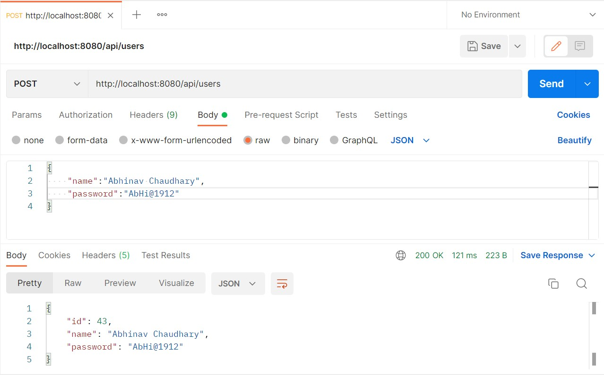

# Intern_Project_Airtel - SpringBoot Application

## Introduction

### Spring Boot
[Spring Boot](https://spring.io/projects/spring-boot) is one of the most famous [Spring](https://spring.io/projects/spring-framework) project used nowadays. It came to facilitate the process of configuring and publishing enterprise applications. It helps create stand-alone, production-grade Spring based applications with minimal effort. **Spring Boot** was conceived to be an "opinionated framework" because it follows an opinionated default configuration approach which reduces the developer efforts configuring the application.

Each application built using **Spring Boot** needs merely to define a Java class annotated with `@SpringBootApplication` as its main entry point. This annotation encapsulates the following other annotations:
- `@Configuration` – marks the class as a source of bean definitions.
- `@EnableAutoConfiguration` – indicates to the framework to add beans based on the dependencies on the classpath automatically.
- `@ComponentScan` – scans for other configurations and beans in the same package as the Application class or below.

## Project Structure
When working with **Spring Boot** projects there is no constrained package structure and the actual structure will be driven by your requirement. However, for convenience and simplicity's sake, the structure of this project is organized, not totally though, by following the MVC (a.k.a. **M**odel **V**iew **C**ontroller) Pattern. You can find more details about this pattern [here](https://examples.javacodegeeks.com/spring-mvc-architecture-overview-example/).

The following are the base folders in which the project is organized and the purpose of each:
- [📁 application](src/main/java/com/abhinav/project/RestAPIProj): contains the main class, annotated with `@SpringBootApplication`, which is responsible for booting up the application;
- [📁 config](src/main/java/com/abhinav/project/RestAPIProj/Config): contains definition of beans through Spring configuration classes annotated with `@Configuration` and used to enable Aes Encryption in the project;
- [📁 controller](src/main/java/com/abhinav/project/RestAPIProj/Controller): contain classes annotated with `@Controller` responsible for processing incoming REST API requests;
- [📁 exception](src/main/java/com/abhinav/project/RestAPIProj/Exception): contain custom exceptions annotated with `@ControllerAdvice` for handling specific data consistent and/or business rule violations;
- [📁 entity](src/main/java/com/abhinav/project/RestAPIProj/Entity): contain POJO classes (a.k.a. **P**lain **O**ld **J**ava **O**bject) annotated with `@Entity` representing database entities i.e., classes mapping database tables; 
- [📁 repository](src/main/java/com/abhinav/project/RestAPIProj/Repository): contain classes annotated with `@Repository` responsible for providing the mechanism for storage, retrieval, search, update and delete operation on objects usually present in a database;
- [📁 test](src/test/java/com/abhinav/project/RestAPIProj): contains class annotated with `@SpringBootTest` in which both Unit and E2E Automated Test Cases are present;

## Prerequisites
- Maven 3+
- Java 8+

## Libraries and Dependencies
- [Spring Web](https://docs.spring.io/spring-framework/docs/current/reference/html/web.html)
- [Spring Data JPA](https://spring.io/projects/spring-data-jpa)
- [Spring MVC (Tomcat)](https://docs.spring.io/spring-framework/docs/3.2.x/spring-framework-reference/html/mvc.html)
- [JUnit 5](https://junit.org/junit5/)
- [Mockito](https://site.mockito.org/)
- [Spring Validation](https://mvnrepository.com/artifact/org.springframework.boot/spring-boot-starter-validation)
- [Hibernate Validator](https://docs.jboss.org/hibernate/validator/6.0/reference/en-US/html_single/)
- [MySQL Database](https://docs.oracle.com/en-us/iaas/mysql-database/doc/getting-started.html)
- [Lombok](https://projectlombok.org/)

## Database configuration 
Create a MySQL database with the name `usersDB` and add the credentials to `/resources/application.properties`. 
The MySQL code looks like this -
<code> create database usersDB;
use usersDB; </code>

The default code for [application.properties](src/main/resources/application.properties) is :

```
spring.datasource.url = jdbc:mysql://localhost:3306/usersDB?useSSL=false
spring.datasource.username = root
spring.datasource.password = 
spring.jpa.properties.hibernate.dialect = org.hibernate.dialect.MySQL5InnoDBDialect
spring.jpa.hibernate.ddl-auto = update
```

## Booting Up the Application
A maven project can be setup in your favorite IDE by multiple ways. Two of them are mentioned below -
1. Using Command Line: <code>mvn spring-boot:run</code>
2. OR Navigate to [src/main](src/main/java/com/abhinav/project/RestAPIProj) and simply right-click and run the file annotated with `@SpringBootApplication`.

After that, head to [http://localhost:8080/api/users](http://localhost:8080/api/users) on your browser or [Postman](https://www.postman.com/) to test the API.

## Testing
1. `Create New Record`
- URL: http://localhost:8080/api/users
- HTTP Method: POST
- Body:
  ````json
  {
    "name": "Abhinav Chaudhary",
    "password": "AbHi@1912",
  }
  ````
  
  
  The MySQL Table Structure is as follows - 
  
  
