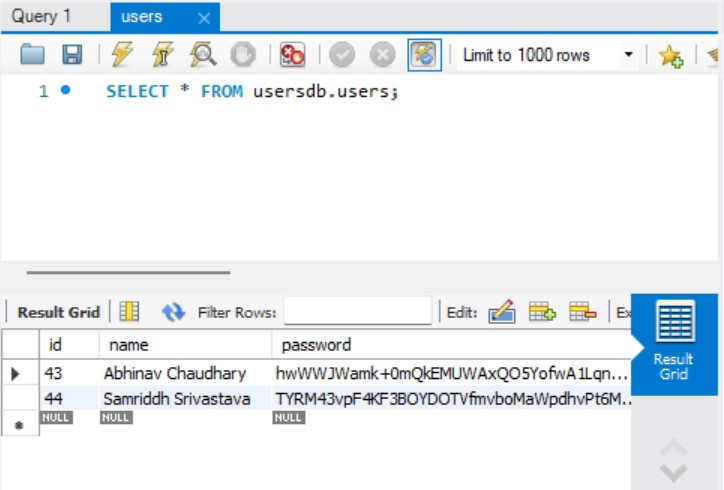
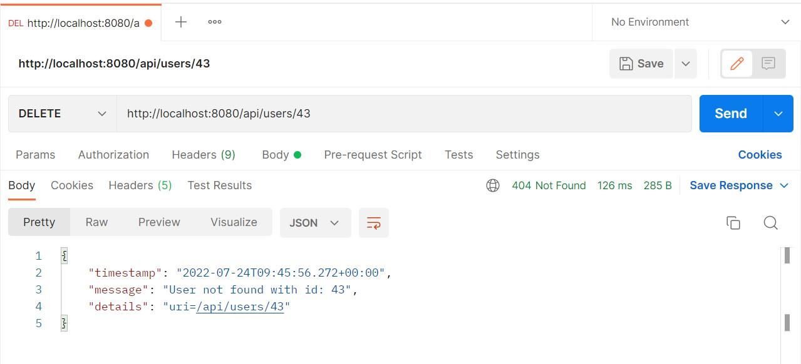
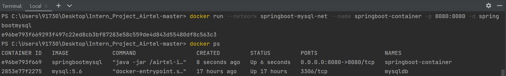
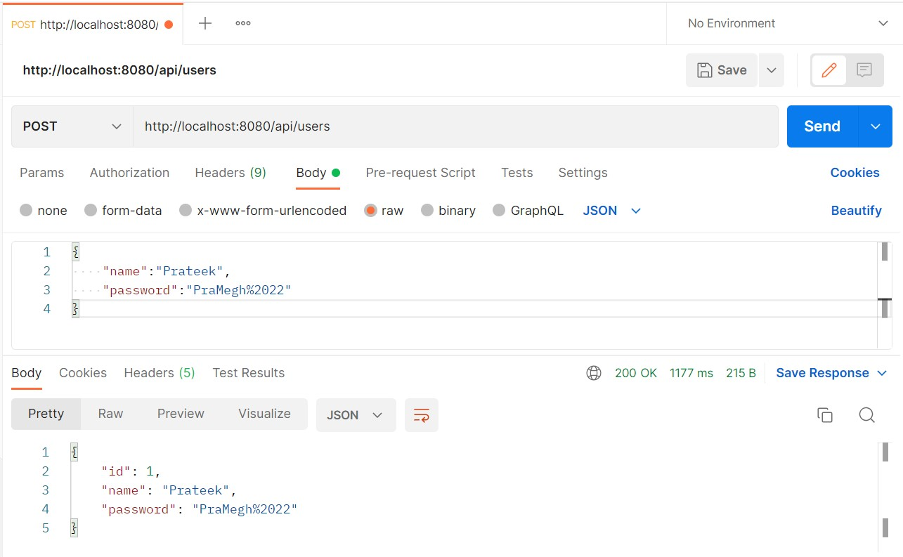

# Intern_Project_Airtel - SpringBoot Application

## Introduction

### Spring Boot
[Spring Boot](https://spring.io/projects/spring-boot) is one of the most famous [Spring](https://spring.io/projects/spring-framework) project used nowadays. It came to facilitate the process of configuring and publishing enterprise applications. It helps create stand-alone, production-grade Spring based applications with minimal effort. **Spring Boot** was conceived to be an "opinionated framework" because it follows an opinionated default configuration approach which reduces the developer efforts configuring the application.

Each application built using **Spring Boot** needs merely to define a Java class annotated with `@SpringBootApplication` as its main entry point. This annotation encapsulates the following other annotations:
- `@Configuration` – marks the class as a source of bean definitions.
- `@EnableAutoConfiguration` – indicates to the framework to add beans based on the dependencies on the classpath automatically.
- `@ComponentScan` – scans for other configurations and beans in the same package as the Application class or below.

## Project Structure
When working with **Spring Boot** projects there is no constrained package structure and the actual structure will be driven by your requirement. However, for convenience and simplicity's sake, the structure of this project is organized, not totally though, by following the MVC (a.k.a. **M**odel **V**iew **C**ontroller) Pattern. You can find more details about this pattern [here](https://examples.javacodegeeks.com/spring-mvc-architecture-overview-example/).

The following are the base folders in which the project is organized and the purpose of each:
- [📁 application](src/main/java/com/abhinav/project/RestAPIProj): contains the main class, annotated with `@SpringBootApplication`, which is responsible for booting up the application;
- [📁 config](src/main/java/com/abhinav/project/RestAPIProj/Config): contains definition of beans through Spring configuration classes annotated with `@Configuration` and used to enable Aes Encryption in the project;
- [📁 controller](src/main/java/com/abhinav/project/RestAPIProj/Controller): contain classes annotated with `@Controller` responsible for processing incoming REST API requests;
- [📁 exception](src/main/java/com/abhinav/project/RestAPIProj/Exception): contain custom exceptions annotated with `@ControllerAdvice` for handling specific data consistent and/or business rule violations;
- [📁 entity](src/main/java/com/abhinav/project/RestAPIProj/Entity): contain POJO classes (a.k.a. **P**lain **O**ld **J**ava **O**bject) annotated with `@Entity` representing database entities i.e., classes mapping database tables; 
- [📁 repository](src/main/java/com/abhinav/project/RestAPIProj/Repository): contain classes annotated with `@Repository` responsible for providing the mechanism for storage, retrieval, search, update and delete operation on objects usually present in a database;
- [📁 test](src/test/java/com/abhinav/project/RestAPIProj): contains class annotated with `@SpringBootTest` in which both Unit and E2E Automated Test Cases are present;

## Prerequisites
- Maven 3+
- Java 8+

## Libraries and Dependencies
- [Spring Web](https://docs.spring.io/spring-framework/docs/current/reference/html/web.html)
- [Spring Data JPA](https://spring.io/projects/spring-data-jpa)
- [Spring MVC (Tomcat)](https://docs.spring.io/spring-framework/docs/3.2.x/spring-framework-reference/html/mvc.html)
- [JUnit 5](https://junit.org/junit5/)
- [Mockito](https://site.mockito.org/)
- [Spring Validation](https://mvnrepository.com/artifact/org.springframework.boot/spring-boot-starter-validation)
- [Hibernate Validator](https://docs.jboss.org/hibernate/validator/6.0/reference/en-US/html_single/)
- [MySQL Database](https://docs.oracle.com/en-us/iaas/mysql-database/doc/getting-started.html)
- [Lombok](https://projectlombok.org/)

## Database configuration 
Create a MySQL database with the name `usersDB` and add the credentials to `/resources/application.properties`. 
The MySQL code looks like this -
<code> create database usersDB;
use usersDB; </code>

The default code for [application.properties](src/main/resources/application.properties) is :

```
spring.datasource.url = jdbc:mysql://localhost:3306/usersDB?useSSL=false
spring.datasource.username = root
spring.datasource.password = 
spring.jpa.properties.hibernate.dialect = org.hibernate.dialect.MySQL5InnoDBDialect
spring.jpa.hibernate.ddl-auto = update
```

## Booting Up the Application
A maven project can be setup in your favorite IDE by multiple ways. Two of them are mentioned below -
1. Using Command Line: <code>mvn spring-boot:run</code>
2. OR Navigate to [src/main](src/main/java/com/abhinav/project/RestAPIProj) and simply right-click and run the file annotated with `@SpringBootApplication`.

After that, head to [http://localhost:8080/api/users](http://localhost:8080/api/users) on your browser or [Postman](https://www.postman.com/) to test the API.

## Testing
1. `Create New Record`
- URL: http://localhost:8080/api/users
- HTTP Method: POST
- Body:
  ````json
  {
    "name": "Abhinav Chaudhary",
    "password": "AbHi@1912",
  }
  ````
  
  
  The MySQL Table Structure is as follows - 
  

2. `General GET Method`
- URL: http://localhost:8080/api/users
- HTTP Method: GET

(Returns List of all users present in Database.)

3. `Get User by ID`
- URL: http://localhost:8080/api/users/{id} 
- HTTP Method: GET
  

4. `Update User`
- URL: http://localhost:8080/api/users/{id}
- HTTP Method: PUT
- Body:
  ````json
  {
    "id":43
    "name": "Aniruddh Chauhan",
    "password": "AnicHau%34"
  }
  ````
  

  The updated value is reflected in the MySQL Database when we reload it -
  
  
4. `Delete User`
- URL: http://127.0.0.1:8080/api/v1/apps/{id}
- HTTP Method: DELETE
  
  
  If we try to look up the deleted user by id we will get an HTTP 404 status code with custom exception handling response:
  

## Unit Test
Unit tests are a must for any business application, regardless of its complexity and size. Therefore, to demonstrate some of the functionality from the combination of **JUnit 5** + **Mockito**, some **Unit** and **Integration** tests were implemented. You can check them by going to the [📁 test](./src/test/java/com/abhinav/project/RestAPIProj) folder. To execute the tests, from the project root, run:
````bash
$ mvn test
````

## Dockerization of the Application
Before beginning dockerization :
- Comment out the [Test .java](./src/test/java/com/abhinav/project/RestAPIProj/RestApiProjApplicationTests.java) file since it interferes with functioning of the Springboot Container.

Now, to dockerlize the Spring Boot Application with the MySQL Database :-
- Create a MySQL docker image using
  <code>docker pull mysql</code> in the command prompt **(Win + R)**.
  
  
- Create a docker network for communication between the Application and Database using
  <code>docker network create springboot-mysql-net</code>.
  
  
- Run the MySQL container in the network - <code>docker run --name mysqldb --network springboot-mysql-net -e MYSQL_ROOT_PASSWORD=___ -e MYSQL_DATABASE=users -e MYSQL_USER=____ -e MYSQL_PASSWORD=____ -d mysql:5.6</code>

  
- Check the database by entering the bash and giving various MySQL commands as given in the snippet below :-

  
- As in below snippet, our **"users"** database exists inside the container but it has no data as of now.

  
- Open the [application.properties](./src/main/resources/application.properties) file and uncomment the code mentioned below (provide username and password entered while creating the docker network):

```
spring.datasource.url = jdbc:mysql://mysqldb:3306/users
spring.datasource.username = 
spring.datasource.password = 
```
  
- Open the Dockerfile. Run the **"mvn clean install"** command to create an **executable** .jar file of the Application under the **target** folder.

  
- Uncomment the code in the **Dockerfile** and provide the name of the .jar file that was created in your IDE.
- Open local terminal in your IDE and run the command - <code>docker build -t springbootmysql .</code> Be sure to include the "dot". This creates a container of the Springboot Application.

  
- Start the Springboot Container in the same network as before :
```
docker run --network springboot-mysql-net --name springboot-container -p 8080:8080 -d springbootmysql
```

  
- Open the logs of the Springboot Container. It shows that the container is successfully running on a Tomcat server.

  
- Go back to the command prompt and run <code>show tables;</code> to see that our **"users"** table is successfully generated inside the database exisiting inside the container. The table is empty as of now.

  
- Fire up [Postman](https://www.postman.com/) and send a **POST** request by providing sample data.

  
- Go back to the command prompt and again run <code>select * from users;</code>. The data is existing in the table with the user name and the encrypted password, like we wanted.

  
